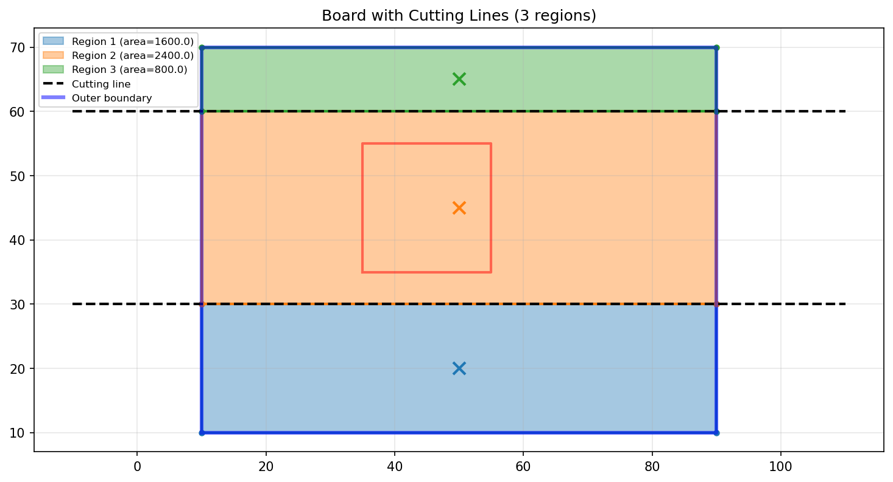
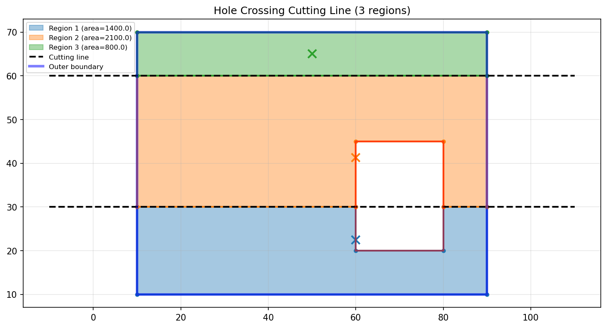
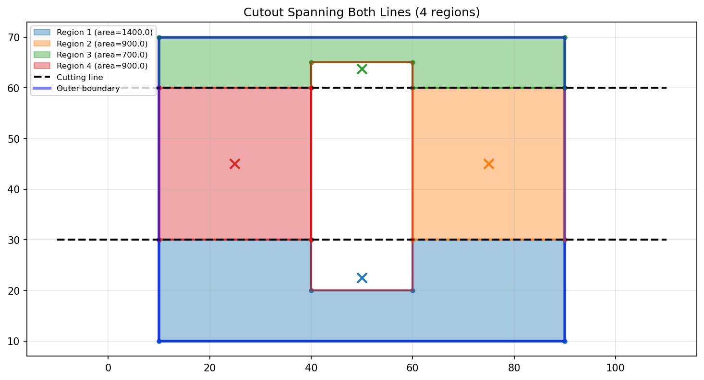
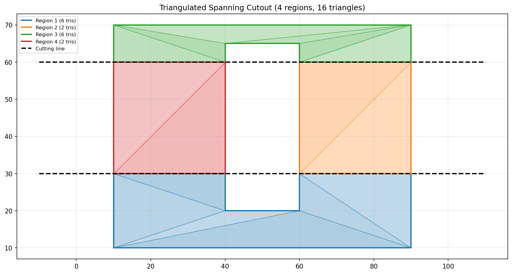
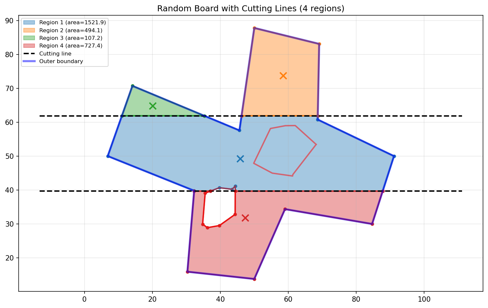
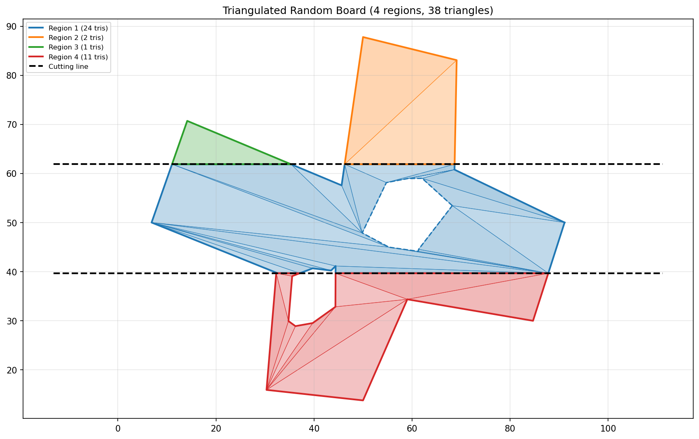

# Bend Zone Triangulation

This document describes the algorithm for triangulating PCB regions separated by bend zone cutting lines, with proper handling of cutouts (holes).

## Problem

When visualizing bent flex PCBs, triangles that span across bend zones create faceted surfaces instead of smooth curves. The solution is to partition the board into separate regions at the bend zone boundaries, then triangulate each region independently.

Key challenges:
- Cutting lines partition the board into strips
- Cutouts (holes) may be entirely within a region, cross one cutting line, or span multiple cutting lines
- Each case requires different handling

## Algorithm Overview

### Step 1: Planar Subdivision

Treat all edges (outer boundary, cutouts, cutting lines) as a planar graph and trace the faces.

```
Input:
- Outer boundary polygon (CCW)
- List of cutout polygons (CW)
- Cutting lines (parallel lines defining bend zones)

Process:
1. Collect all polygon edges, splitting at cutting line intersections
2. Collect cutting line segments (clipped to board interior)
3. Build vertex adjacency structure (edges sorted by angle at each vertex)
4. Trace region boundaries using "next clockwise edge" rule
```

### Step 2: Filter Valid Regions

The traced regions include:
- Board material regions (what we want)
- Exterior region (outside the board)
- Hole interiors

Filter by:
- Positive signed area (CCW winding = filled region)
- Test point inside outer boundary
- Test point outside all holes

### Step 3: Associate Holes with Regions

Holes that don't cross any cutting line need to be associated with their containing region for triangulation.

```
For each original hole:
    If hole crosses cutting lines:
        Skip (boundary already incorporated into region edges)
    Else:
        Find region containing hole's centroid
        Associate hole with that region
```

### Step 4: Triangulate Each Region

Use ear-clipping triangulation with holes for each region.

## Test Cases

### Case 1: Hole Entirely Within a Region

The hole is in the middle strip and doesn't cross any cutting line.

**Regions:**


- 3 regions created (bottom, middle, top strips)
- Hole remains as separate polygon associated with middle region

**Triangulation:**


- Bottom strip: 2 triangles
- Middle strip: 8 triangles (triangulates around the hole)
- Top strip: 2 triangles

### Case 2: Hole Crossing One Cutting Line

The hole crosses the lower cutting line (y=30).

**Regions:**


- Hole boundary is incorporated into region edges
- Bottom region (blue) includes part of hole boundary
- Middle region (orange) includes other part of hole boundary
- No separate hole association needed

### Case 3: Hole Spanning Both Cutting Lines

The hole extends from below the first cutting line to above the second.

**Regions:**


- Middle strip is split into LEFT and RIGHT regions
- 4 total regions instead of 3
- Hole boundary incorporated into all adjacent regions

**Triangulation:**


- Bottom: 6 triangles (U-shape around hole)
- Middle-left: 2 triangles
- Middle-right: 2 triangles
- Top: 6 triangles (U-shape around hole)

### Case 4: Complex Non-Rectangular Board

Random concave board with multiple holes.

**Regions:**


- Handles non-rectangular outer boundary
- Multiple cutting line intersections per edge
- Holes correctly partitioned or associated

**Triangulation:**


- Region 1 (blue): 24 triangles (has associated hole)
- Region 2 (orange): 2 triangles
- Region 3 (green): 1 triangle
- Region 4 (red): 11 triangles

## Key Data Structures

```python
class PlanarSubdivision:
    """Computes regions by partitioning a polygon with cutting lines."""

    def __init__(self, outer, holes, cutting_lines):
        self.outer = outer          # Outer boundary (CCW)
        self.holes = holes          # Cutout polygons (CW)
        self.cutting_lines = cutting_lines

        self.vertices = []          # All unique vertices
        self.edges = []             # All edges (start_idx, end_idx)
        self.vertex_edges = {}      # Adjacency: vertex -> [(angle, edge, dir)]
        self.regions = []           # Traced region boundaries

    def compute(self):
        # 1. Collect and split edges at intersections
        # 2. Build adjacency structure
        # 3. Trace regions using CW traversal
        return self.regions
```

## Implementation Notes

1. **Vertex deduplication**: Use rounded coordinates as dictionary keys to handle floating-point precision

2. **Edge direction**: Each edge can be traversed in two directions; track (edge_idx, direction) pairs

3. **Next edge selection**: At each vertex, select the next edge clockwise from the incoming direction (rightmost turn)

4. **Winding order**:
   - CCW (positive area) = filled region interior
   - CW (negative area) = hole or exterior

5. **Test point selection**: Use a point offset inward from edge midpoint rather than centroid (centroid may fall inside a hole)
